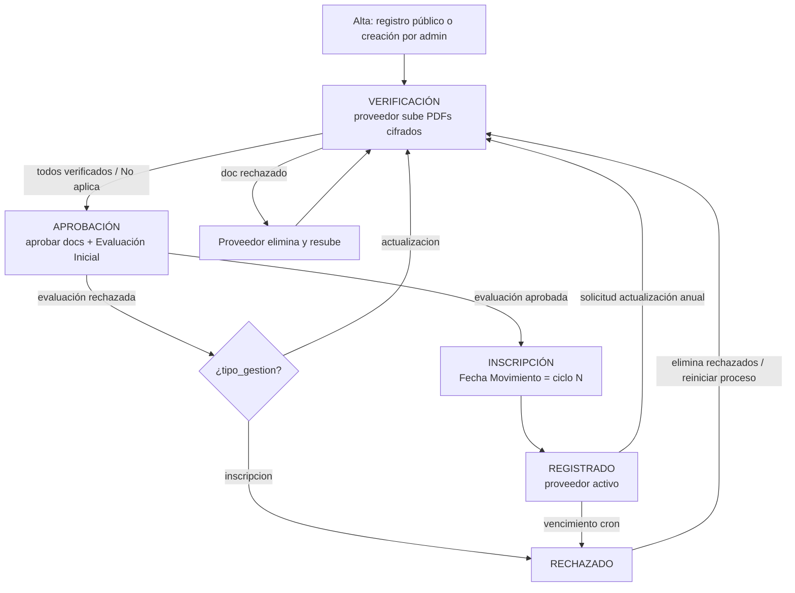
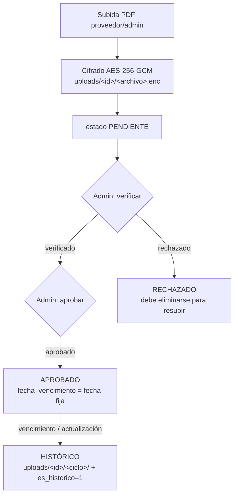
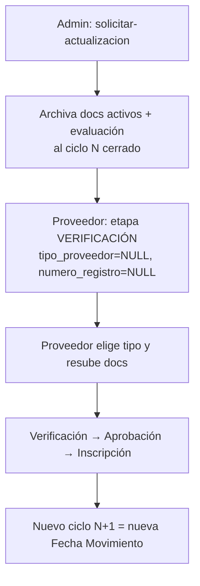
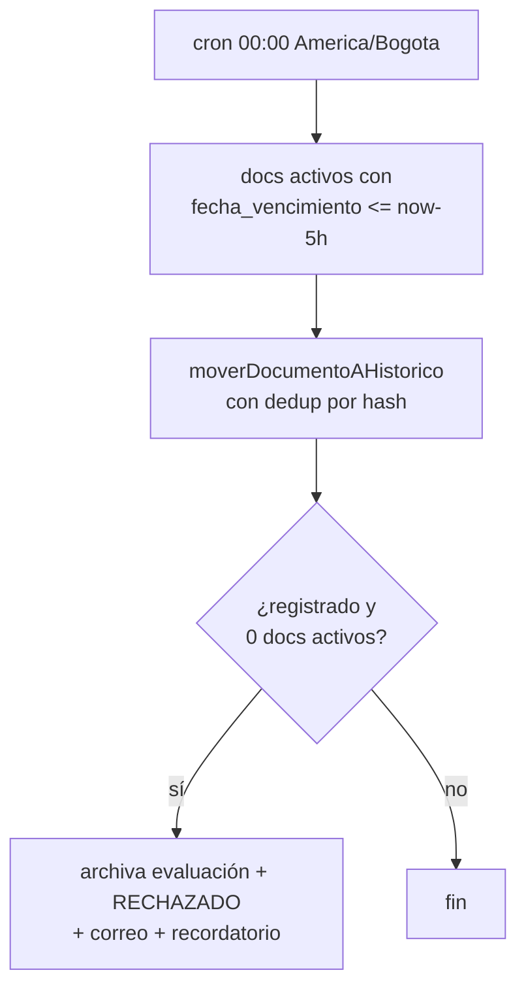
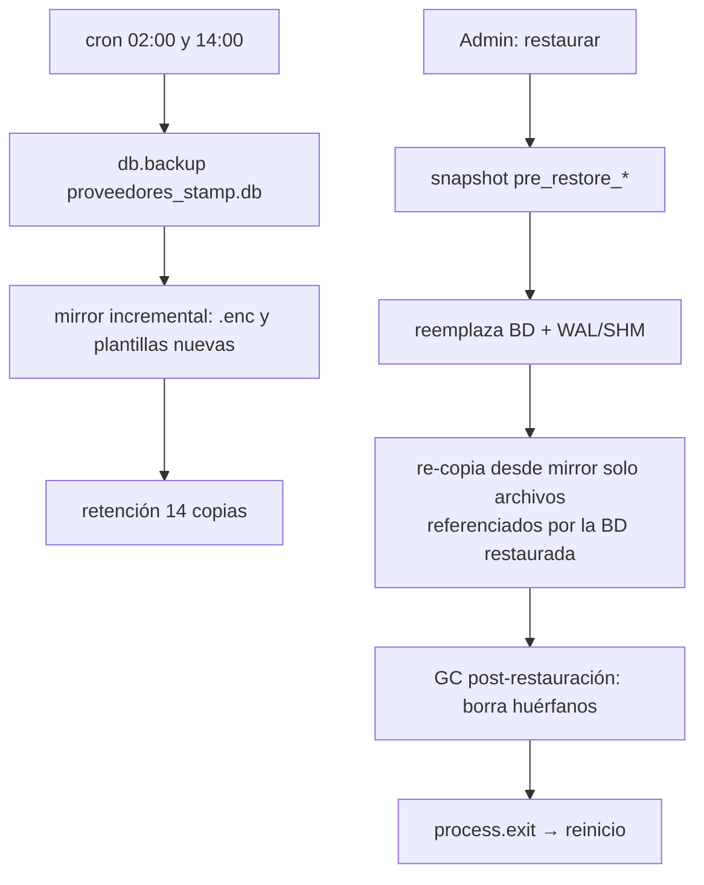

# 📚 HANDOFF v2 — Portal de Gestión Documental de Proveedores UNAB
> Documento único de contexto técnico. Leer completo antes de tocar código.
> Regla de trabajo: parches quirúrgicos "Busca/Reemplaza" con anclas exactas; nunca reescribir archivos completos.
> Entregar cada parte de código que se deba reemplazar con su respectiva gerarquia y no en texto plano sin formato, para llevar un orden en la aplicacion del código.

---

## 1. RESUMEN EJECUTIVO
Sistema web de gestión documental de proveedores UNAB: inscripción → verificación → aprobación → inscripción/registro → actualización anual, con cifrado AES-256-GCM en reposo, archivado histórico por ciclos, notificaciones por correo y panel administrativo completo.
- **Stack:** Node.js + Express (monolito `server.js`), SQLite (`better-sqlite3`, WAL), Socket.IO, Multer (memory), archiver (ZIP), exceljs, node-cron, helmet, express-rate-limit, session-file-store.
- **Front:** `public/index.html` (login), `public/admin.html`, `public/proveedor.html`, `public/style.css` (marca UNAB v4.4→v6). Vanilla JS.
- **Rutas de datos:** `dataDir = RAILWAY_VOLUME_MOUNT_PATH || __dirname`; `uploads/<proveedorId>/` (activos) y `uploads/<proveedorId>/<ciclo>/` (históricos); `plantillas/`; `backups/` (+ `uploads_mirror`, `plantillas_mirror`); `sessions/`.
- **Roles:** `admin`, `proveedor`. Etapas: `verificacion → aprobacion → inscripcion → registrado` (+ `rechazado`).
- **Tipos de persona:** `juridica` (14 documentos) / `natural` (sin cuenta_bancaria, experiencia 1–2, +competencias opcional).

## 2. MODELO DE DATOS (tablas)
`usuarios`, `proveedores`, `documentos`, `plantillas`, `historial`, `recordatorios`, `notas_proveedor`, `logs_seguridad`, `habeas_data_consent`, `password_resets`, `configuracion`, `ciclos_actualizacion`.
Claves: `documentos.es_historico` + `ciclo` (archivado); `documentos.verificado`, `estado`, `no_aplica`, `fecha_vencimiento`; `proveedores.evaluacion_inicial` (evaluación activa en raíz); `proveedores.numero_registro` = Fecha Movimiento = ciclo.

---

## 3. 🆕 ANEXO A — DIAGRAMAS DE FLUJO

### A.1 Ciclo de vida del proveedor


### A.2 Flujo de un documento


### A.3 Actualización anual


### A.4 Vencimientos (cron 00:00)


### A.5 Backups y restauración


### A.6 Cola de correos
```mermaid
flowchart TD
    E[cualquier flujo llama enviarEmail()] --> Q[Cola FIFO en memoria<br/>prioridad transaccional > masivo]
    Q --> W[5 workers concurrentes]
    W --> T{Transporte genérico}
    T -->|BREVO_API_KEY| B1[API Brevo]
    T -->|fallback SMTP_*| B2[SMTP relay]
    T -->|200| OK[entregado + log]
    T -->|429 / 5xx| R[reintento backoff 5s→25s→125s]
    R -->|3 fallos| F[marcado fallido + log + toast admin]
```

---

## 4. 🆕 ANEXO B — ENDPOINTS (método, ruta, parámetros, auth)

### B.1 Autenticación y seguridad
| Método | Ruta | Parámetros / Body | Auth | Detalle |
|---|---|---|---|---|
| POST | `/api/login` | body: `email, password` | Público | Regenera sesión; rate-limit 20/15 min; hash dummy anti-timing |
| POST | `/api/logout` | — | Sesión | Destruye sesión |
| GET | `/api/me` | — | Sesión | Usuario actual + `debe_cambiar_password` |
| POST | `/api/cambiar-password` | body: `password_actual, password_nueva` | Sesión | Valida fuerza y diferencia |
| POST | `/api/recuperar-password` | body: `email` | Público | Token hasheado SHA-256, expira 1 h |
| GET | `/api/verificar-token/:token` | path `token` | Público | Validez del token |
| POST | `/api/restablecer-password` | body: `token, password` | Público | Restablece e invalida tokens |
| POST | `/api/registro` | body: `email, password, nombre_empresa, habeas_data, website`(honeypot)`, _ts`(ms) | Público | Anti-bot timing ≥3000 ms |
| GET | `/api/habeas-data/check` | — | Sesión | Estado de consentimiento |
| POST | `/api/proveedor/habeas-data/aceptar` | — | Proveedor | Registra consentimiento |
| GET | `/api/admin/habeas-data` | — | Admin | Listado aceptaciones |
| GET | `/api/admin/habeas-data/export` | — | Admin | CSV con BOM |

### B.2 Portal del proveedor
| Método | Ruta | Parámetros / Body | Auth | Detalle |
|---|---|---|---|---|
| GET | `/api/proveedor/info` | — | Proveedor | Perfil + `todos_subidos/verificados` |
| POST | `/api/proveedor/datos` | body: `razon_social, rfc, representante, telefono, direccion, tipo_persona, email` | Proveedor | Datos + cambio de correo propio |
| GET | `/api/proveedor/requerimientos` | query `tipo` (solo admin) | Sesión | Lista según tipo de persona |
| GET | `/api/proveedor/documentos` | — | Proveedor | Documentos activos |
| POST | `/api/proveedor/documento` | multipart `archivo`+`tipo` **o** JSON `{tipo, no_aplica}` | Proveedor | Subida PDF / marcador No aplica |
| POST | `/api/proveedor/documento/:id/no-aplica` | body: `no_aplica` | Proveedor | Marca/desmarca |
| DELETE | `/api/proveedor/documento/:id` | path `id` | Proveedor | Solo no verificados/aprobados |
| GET | `/api/proveedor/plantilla/:tipo` | path `tipo` | Proveedor | Descarga plantilla |
| GET | `/api/proveedor/historial` | — | Proveedor | Últimos 200 eventos |
| GET | `/api/proveedor/recordatorios` | — | Proveedor | Abiertos |
| POST | `/api/proveedor/recordatorio/:id/leido` | path `id` | Proveedor | Marca leído |
| POST | `/api/proveedor/recordatorio/:id/cerrar` | path `id` | Proveedor | Cierra |
| GET | `/api/proveedor/notas` | — | Proveedor | Abiertas |
| POST | `/api/proveedor/nota/:id/leida` | path `id` | Proveedor | Marca leída |
| POST | `/api/proveedor/nota/:id/cerrar` | path `id` | Proveedor | Cierra |

### B.3 Admin — proveedores y documentos
| Método | Ruta | Parámetros / Body | Auth | Detalle |
|---|---|---|---|---|
| GET | `/api/admin/proveedores` | query: `page, limit, busqueda, estado, modulo, filtroVerificacion` | Admin | Paginado + conteos por tipo |
| GET | `/api/admin/stats` | — | Admin | KPIs por etapa |
| GET | `/api/admin/proveedor/:id` | path `id` | Admin | Detalle + activos + históricos + requeridos |
| POST | `/api/admin/proveedor` | body: `email, password?, nombre_empresa, razon_social, rfc, representante, telefono, direccion, tipo_proveedor` | Admin | Sin contraseña → token activación 7 d |
| DELETE | `/api/admin/proveedor/:id` | body: `password` admin | Admin | Borrado total en cascada |
| GET/POST | `/api/admin/proveedor/:id/gestion` | body: `numero_registro, tipo_gestion, notas_gestion, tipo_proveedor` | Admin | 409 `ciclo_duplicado` si repite Fecha Movimiento |
| POST | `/api/admin/proveedor/:id/email` | body: `email` | Admin | Cambia correo + cierra sesiones del proveedor |
| POST | `/api/admin/proveedor/:id/tipo-persona` | body: `tipo_proveedor, forzar` | Admin | 409 `requiere_confirmacion` si hay docs activos |
| POST | `/api/admin/proveedor/:id/reiniciar-proceso` | — | Admin | Desde rechazado → verificación |
| POST | `/api/admin/proveedor/:id/solicitar-actualizacion` | body: `mensaje` | Admin | Archiva todo al ciclo y notifica |
| GET | `/api/admin/proveedor/:id/historial` | — | Admin | 500 eventos |
| POST | `/api/admin/proveedor/:id/recordatorio` | body: `mensaje` | Admin | Envía + socket |
| GET | `/api/admin/proveedor/:id/notas` | — | Admin | Listado |
| POST | `/api/admin/proveedor/:id/nota` | body: `titulo, nota` | Admin | Crudo (textContent en front) |
| GET | `/api/admin/proveedor/:id/documentos/zip` | — | Admin | ZIP activos + evaluación |
| POST | `/api/admin/proveedor/:id/documento` | multipart `archivo, tipo` | Admin | Subida en nombre del proveedor |
| POST | `/api/admin/proveedor/:id/documento/:docId/no-aplica` | body: `no_aplica, tipo` | Admin | Marca/desmarca |
| DELETE | `/api/admin/documento/:id` | path `id` | Admin | Borra archivo + registro |
| POST | `/api/admin/documento/:id/verificar` | body: `verificado` (bool) | Admin | Verificación; auto-pasa a aprobación |
| POST | `/api/admin/documento/:id/estado` | body: `estado, comentario` | Admin | Aprueba/rechaza; rechazo obliga eliminar para resubir |
| GET | `/api/admin/documento/:id/verificar-integridad` | — | Admin | Compara hash SHA-256 |
| GET | `/api/admin/proveedor/:id/evaluacion` | — | Admin | Lee evaluación |
| POST | `/api/admin/proveedor/:id/evaluacion` | multipart `archivo` | Admin | Solo etapa aprobación |
| POST | `/api/admin/proveedor/:id/evaluacion/estado` | body: `estado, comentario` | Admin | Aprobar exige todos los docs aprobados |
| DELETE | `/api/admin/proveedor/:id/evaluacion` | — | Admin | Solo no aprobada |
| GET | `/api/admin/proveedor/:id/evaluacion/download` | — | Admin | Descifra y sirve PDF |

### B.4 Admin — ciclos, exportes, plantillas, sistema
| Método | Ruta | Parámetros / Body | Auth | Detalle |
|---|---|---|---|---|
| GET | `/api/admin/ciclos` | query: `page, limit, busqueda, año, rfc, estado` | Admin | Historial de ciclos |
| GET | `/api/admin/ciclos/anos` | — | Admin | Años distintos |
| GET | `/api/admin/ciclos/:id/documentos` | — | Admin | Docs + evaluación resuelta del ciclo |
| GET | `/api/admin/ciclos/:id/zip` | — | Admin | ZIP histórico + evaluación |
| GET | `/api/admin/proveedores/export` | query: `busqueda, estado` | Admin | JSON para CSV/Excel |
| POST | `/api/admin/exportar-excel` | body: `proveedores[]` | Admin | XLSX server-side (exceljs) |
| GET | `/api/admin/plantillas` | — | Admin | Listado |
| POST | `/api/admin/plantilla` | multipart `archivo, tipo` | Admin | Reemplaza archivo antiguo |
| GET | `/api/admin/configuracion` | — | Admin | `fecha_vencimiento_fija` |
| PUT | `/api/admin/configuracion` | body: `valor` (YYYY-MM-DDTHH:mm) | Admin | TZ civil Bogotá |
| POST | `/api/admin/recalcular-vencimientos` | — | Admin | Reasigna fecha fija a aprobados activos |
| POST | `/api/admin/ejecutar-vencimientos` | — | Admin | Ejecuta cron manualmente |
| POST | `/api/admin/forzar-vencimientos` | — | Admin | Archiva TODO activo (irreversible) |
| GET | `/api/admin/backups` | — | Admin | Listado |
| POST | `/api/admin/backups/crear` | — | Admin | Backup + mirror |
| GET | `/api/admin/backups/:nombre` | — | Admin | Descarga |
| GET | `/api/admin/backups/:nombre/verificar` | — | Admin | integrity_check + conteos |
| POST | `/api/admin/backups/:nombre/restaurar` | — | Admin | Snapshot + restore + GC + reinicio |
| POST | `/api/admin/limpiar-sesiones` | — | Admin | Conserva sesión actual |
| POST | `/api/admin/limpiar-rate-limits` | — | Admin | Resetea limiters |
| GET | `/api/admin/configuracion-seguridad` | — | Admin | Estado de claves |
| GET | `/api/admin/diagnosticar-cifrado` | — | Admin | Prueba cifrado |
| GET | `/uploads/:path(*)` | query `download=true` | Sesión | Anti path-traversal; descifra on-the-fly; header dual RFC 6266/5987 |
| GET | `/plantillas/*`, `/fonts/*`, `/img/*`, estáticos | — | Público | Estáticos |

### B.5 Cron y Socket.IO
| Cron | Zona | Acción |
|---|---|---|
| `0 8 * * *` | America/Bogota | Recordatorios de documentos faltantes (dedup 7 d) |
| `0 0 * * *` | America/Bogota | Vencimientos → histórico + rechazo + correo |
| `30 3 * * *` | America/Bogota | Limpieza `logs_seguridad` (90 días) |
| `0 2,14 * * *` | America/Bogota | Backup BD + mirror incremental (retención 14) |

| Evento Socket.IO | Emisor → | Uso |
|---|---|---|
| `documento_subido` / `documento_actualizado` / `documento_verificado` | admin+proveedor | Recarga vistas |
| `evaluacion_actualizada` | admin+proveedor | Recarga |
| `proveedor_registrado` / `proveedores_actualizados` / `estadisticas_actualizadas` | admin | KPIs y listas |
| `vencimientos_procesados` | admin | Toast con conteos |
| `nuevo_recordatorio` / `nueva_nota` | proveedor | Toast + recarga |
| `solicitud_actualizacion` / `tipo_persona_actualizado` | proveedor | Recarga/redirect |

---

## 5. 🆕 ANEXO C — COLA DE CORREOS (detalle)
- **Ubicación:** `email.js` expone `enviarEmail()` ya envuelto en la cola; `server.js` NUNCA llama al transporte directamente.
- **Transporte genérico:** si `BREVO_API_KEY` → API Brevo; si no, fallback `SMTP_HOST/PORT/USER/PASS`; `EMAIL_FROM` como remitente. Cambiar de proveedor no toca `server.js`.
- **Cola FIFO en memoria** con prioridad: transaccional (bienvenida, rechazos, recuperación) > masivo (recordatorios cron).
- **Parámetros:** concurrencia 5 workers; ventana 1000 ms con máx 10 envíos (throttle anti-429); reintentos 3 con backoff 5 s → 25 s → 125 s; tras 3 fallos se marca fallido, se loguea y se notifica al admin por toast.
- **Dedup:** no se envían dos correos del mismo tipo al mismo destinatario en ventana de 24 h (aplica a recordatorios y notificaciones de completitud).
- **No persiste:** al reiniciar, lo masivo pendiente se regenera con el cron; lo transaccional ya fue entregado o falló con log.
- **Observabilidad:** log por envío (`✅/❌`) + `logs_seguridad` en eventos críticos + eventos Socket.IO.
- **Anti-spam:** SPF/DKIM/DMARC del dominio remitente; asuntos estables; ratio texto/imagen cuidado; enlaces con `APP_URL_NORMALIZADO`.

---

## 6. SEGURIDAD (resumen)
AES-256-GCM en reposo (IV aleatorio + PBKDF2 100k); bcrypt cost 12 + hash dummy; tokens de recuperación hasheados; honeypot + timing anti-bot; rate-limits por ruta; helmet CSP estricta + HSTS; `sameSite=lax`; sanitización de errores 500; anti path-traversal; validación magic-bytes PDF; CSV anti-inyección de fórmulas; sesiones file-store con limpieza y cierre por cambio de correo.

## 7. AGENDA
✅ Cerrado: plantillas con instrucciones, cambio de correo, NIT en historial, ciclo duplicado, usabilidad, SweetAlert2, colas/jobs, backups/DR, dedup de archivos.
⏳ Pendiente: categorías/subcategorías y métricas de proveedores (futuro lejano, decisión del dueño).

## 8. REGLAS DE TRABAJO
1. Parches "Busca/Reemplaza" con anclas exactas; pedir código por CMD antes de parchear archivos no vistos.
2. Entregar código en bloques con jerarquía y comentarios.
3. Verificar con `node --check server.js`, `npm test` y Ctrl+F5.
4. No tocar `ENCRYPTION_KEY`; `NODE_ENV=development` en local (cookie `secure` solo en producción).

## ANEXO C — DICCIONARIO DE DATOS (campo por campo)

> Convenciones globales:
> - Todas las fechas se guardan como **string civil de Bogotá** (`datetime('now','-05:00')`), nunca UTC.
> - Boleanos se modelan como `INTEGER 0/1`.
> - FKs con `ON DELETE CASCADE`: borrar un usuario/proveedor arrastra sus hijos.
> - Rutas de archivo **relativas** a `dataDir` (RAILWAY_VOLUME_MOUNT_PATH o raíz del proyecto).

### C.1 `usuarios` — Cuentas de acceso (admin y proveedores)
| Campo | Tipo | Restricciones / Default | Descripción / uso |
|---|---|---|---|
| `id` | INTEGER | PK AUTOINCREMENT | ID interno del usuario |
| `email` | TEXT | UNIQUE NOT NULL | Credencial de login (minúsculas); destino de notificaciones |
| `password` | TEXT | NOT NULL | Hash bcrypt cost 12 (nunca plaintext) |
| `rol` | TEXT | NOT NULL CHECK IN ('admin','proveedor') | Rol del usuario |
| `nombre_empresa` | TEXT | NULL | Nombre de empresa (proveedor) o 'Administración' (admin) |
| `debe_cambiar_password` | INTEGER | DEFAULT 1 | Bloquea escrituras (middleware `requierePasswordCambiada`) hasta cambiarla |
| `intentos_fallidos` | INTEGER | DEFAULT 0 | Contador de login fallidos (bloqueo de proveedor al 5º intento) |
| `bloqueado_hasta` | DATETIME | NULL | Fin del bloqueo temporal (15 min); admin nunca se bloquea |
| `creado_en` | DATETIME | now -05:00 | Fecha de creación de la cuenta |

### C.2 `proveedores` — Expediente del proveedor (1:1 con usuario)
| Campo | Tipo | Restricciones / Default | Descripción / uso |
|---|---|---|---|
| `id` | INTEGER | PK AUTOINCREMENT | ID del proveedor (carpeta `uploads/<id>/`) |
| `usuario_id` | INTEGER | UNIQUE NOT NULL, FK usuarios(id) CASCADE | Cuenta propietaria del expediente |
| `razon_social` | TEXT | NULL | Razón social / nombre completo |
| `rfc` | TEXT | NULL | NIT / RUT |
| `representante` | TEXT | NULL | Representante legal |
| `telefono` | TEXT | NULL | Teléfono de contacto |
| `direccion` | TEXT | NULL | Dirección |
| `estado_general` | TEXT | DEFAULT 'pendiente' CHECK IN ('pendiente','aprobado','rechazado') | Estado global calculado por `actualizarEstadoProveedor()` |
| `fecha_aprobacion` | DATETIME | NULL | Fecha en que pasó a 'aprobado' |
| `ultimo_recordatorio_envio` | DATETIME | NULL | Último recordatorio automático (cron 8 AM, ventana 7 días) |
| `todos_subidos` | INTEGER | DEFAULT 0 | Flag: todos los tipos requeridos tienen carga |
| `todos_verificados` | INTEGER | DEFAULT 0 | Flag: todos verificados/no-aplica → promueve a 'aprobacion' |
| `numero_registro` | TEXT | NULL | "Fecha Movimiento" / número de registro; identifica el ciclo activo; NULL si rechazado |
| `tipo_gestion` | TEXT | CHECK IN ('inscripcion','actualizacion') | Origen del proceso actual (alta o renovación) |
| `notas_gestion` | TEXT | NULL | Nota del admin al inscribir/rechazar (ej. "Rechazado por vencimiento…") |
| `fecha_gestion` | DATETIME | NULL | Fecha de la última gestión de inscripción |
| `etapa` | TEXT | DEFAULT 'verificacion' CHECK IN ('verificacion','aprobacion','inscripcion','registrado','rechazado') | Etapa actual del flujo |
| `evaluacion_inicial` | TEXT | NULL | Ruta relativa del `.enc` de Evaluación Inicial **activa**; NULL si no hay o fue archivada |
| `evaluacion_estado` | TEXT | DEFAULT 'pendiente' CHECK IN ('pendiente','aprobado','rechazado') | Estado de la Evaluación Inicial |
| `evaluacion_fecha` | DATETIME | NULL | Fecha de subida de la evaluación |
| `tipo_proveedor` | TEXT | NULL ('natural' \| 'juridica') | Define la lista de requerimientos; NULL = sin definir (portal bloqueado) |

### C.3 `documentos` — Documentos subidos (activos e históricos)
| Campo | Tipo | Restricciones / Default | Descripción / uso |
|---|---|---|---|
| `id` | INTEGER | PK AUTOINCREMENT | ID del documento |
| `proveedor_id` | INTEGER | NOT NULL, FK proveedores(id) CASCADE | Propietario |
| `tipo` | TEXT | NOT NULL | Código de requerimiento (gaf01, gaf07, gaf08, carta_ica, rut, camara_comercio, cedula_rl, estados_financieros, parafiscales, calidad, sgsst, experiencia, cuenta_bancaria, ambiental, competencias) |
| `archivo` | TEXT | NOT NULL | Ruta relativa del `.enc`: activa `<id>/<nombre>.enc`; histórica `<id>/<ciclo>/<nombre>.enc`; `'no_aplica'` para marcadores |
| `nombre_original` | TEXT | NULL | Nombre original del PDF subido |
| `hash_archivo` | TEXT | NULL | SHA-256 del PDF en claro (verificación de integridad) |
| `estado` | TEXT | DEFAULT 'pendiente' CHECK IN ('pendiente','aprobado','rechazado') | Estado de revisión |
| `comentario` | TEXT | NULL | Motivo de rechazo / nota de archivado |
| `no_aplica` | INTEGER | DEFAULT 0 | Marcador de documento opcional no aplicable |
| `verificado` | INTEGER | DEFAULT 0 | Checkbox de verificación del admin (prerrequisito de aprobación) |
| `fecha_vencimiento` | DATETIME | NULL | Vencimiento = fecha fija de `configuracion` al aprobar |
| `ciclo` | TEXT | NULL | Ciclo (numero_registro) al que pertenece |
| `es_historico` | INTEGER | DEFAULT 0 | 1 = archivado (solo lectura) |
| `fecha_archivado` | DATETIME | NULL | Fecha de archivado |
| `subido_en` | DATETIME | now -05:00 | Fecha de subida |

### C.4 `plantillas` — Formatos institucionales descargables
| Campo | Tipo | Restricciones / Default | Descripción / uso |
|---|---|---|---|
| `id` | INTEGER | PK AUTOINCREMENT | ID de la plantilla |
| `tipo` | TEXT | UNIQUE NOT NULL | Tipo con plantilla (gaf01, gaf07, gaf08, carta_ica) |
| `archivo` | TEXT | NOT NULL | Nombre en `plantillas/` (sin cifrar) |
| `nombre_original` | TEXT | NULL | Nombre visible para descarga |
| `subido_en` | DATETIME | now -05:00 | Fecha de carga |

### C.5 `historial` — Auditoría de eventos por proveedor
| Campo | Tipo | Restricciones / Default | Descripción / uso |
|---|---|---|---|
| `id` | INTEGER | PK AUTOINCREMENT | ID del evento |
| `proveedor_id` | INTEGER | NOT NULL, FK proveedores(id) CASCADE | Proveedor afectado |
| `usuario_id` | INTEGER | NULL | Ejecutor (NULL = Sistema) |
| `usuario_nombre` | TEXT | NULL | Email del ejecutor o 'Sistema' |
| `accion` | TEXT | NOT NULL | Código de evento: registro, documento_subido, documento_reemplazado, documento_eliminado, documento_verificado, documento_no_aplica, documento_requiere_carga, cambio_etapa, datos_actualizados, email_cambiado, email_cambiado_admin, gestion_actualizada, evaluacion_subida, evaluacion_estado_cambiado, evaluacion_eliminada, evaluacion_rechazada_actualizacion, evaluacion_rechazada_con_retroceso, tipo_persona_definido, recordatorio_enviado, nota_agregada, solicitud_actualizacion, vencimiento_automatico, vencimiento_forzado, recordatorio_vencimiento, rechazo_limpiado, etapa_normalizada, proceso_reiniciado, notificacion_admin_completos |
| `detalle` | TEXT | NULL | Texto legible (escapeHtml al escribir) |
| `documento_tipo` | TEXT | NULL | Tipo de documento afectado |
| `documento_id` | INTEGER | NULL | ID del documento afectado |
| `ip_origen` | TEXT | NULL | IP del ejecutor |
| `creado_en` | DATETIME | now -05:00 | Fecha del evento |

### C.6 `recordatorios` — Mensajes admin → proveedor
| Campo | Tipo | Restricciones / Default | Descripción / uso |
|---|---|---|---|
| `id` | INTEGER | PK AUTOINCREMENT | ID |
| `proveedor_id` | INTEGER | NOT NULL, FK CASCADE | Destinatario |
| `admin_id` | INTEGER | NOT NULL | Admin emisor |
| `admin_nombre` | TEXT | NULL | Email del admin |
| `mensaje` | TEXT | NOT NULL | Texto CRUDO (se pinta con textContent, anti-XSS) |
| `leido` | INTEGER | DEFAULT 0 | Marcado al abrirlo el proveedor |
| `cerrada` | INTEGER | DEFAULT 0 | Oculto tras cerrarlo |
| `creado_en` | DATETIME | now -05:00 | Fecha de envío |

### C.7 `notas_proveedor` — Notas admin → proveedor
| Campo | Tipo | Restricciones / Default | Descripción / uso |
|---|---|---|---|
| `id` | INTEGER | PK AUTOINCREMENT | ID |
| `proveedor_id` | INTEGER | NOT NULL, FK CASCADE | Destinatario |
| `admin_id` | INTEGER | NOT NULL | Admin emisor |
| `admin_nombre` | TEXT | NULL | Email del admin |
| `titulo` | TEXT | NOT NULL | Título de la nota |
| `nota` | TEXT | NOT NULL | Cuerpo CRUDO (textContent) |
| `leida` | INTEGER | DEFAULT 0 | Leída por el proveedor |
| `cerrada` | INTEGER | DEFAULT 0 | Cerrada/oculta |
| `creado_en` | DATETIME | now -05:00 | Fecha |

### C.8 `logs_seguridad` — Auditoría de seguridad (retención 90 días)
| Campo | Tipo | Restricciones / Default | Descripción / uso |
|---|---|---|---|
| `id` | INTEGER | PK AUTOINCREMENT | ID |
| `usuario_id` | INTEGER | NULL | Usuario implicado |
| `email` | TEXT | NULL | Email implicado |
| `accion` | TEXT | NOT NULL | login, login_fallido_admin, registro_proveedor, registro_bot_honeypot, registro_bot_too_fast, cambio_password, logout, habeas_data_aceptado, path_traversal_bloqueado, backup_manual, backup_restaurado, email_cambiado_admin, configuracion_actualizada, recalcular_vencimientos, eliminar_proveedor, eliminar_proveedor_fallido |
| `ip_origen` | TEXT | NULL | IP |
| `user_agent` | TEXT | NULL | UA truncado a 200 chars |
| `detalle` | TEXT | NULL | Detalle operativo |
| `exitoso` | INTEGER | NULL | 1 éxito / 0 fallo |
| `creado_en` | DATETIME | now -05:00 | Fecha; cron 3:30 AM purga >90 días |

### C.9 `habeas_data_consent` — Consentimiento de datos
| Campo | Tipo | Restricciones / Default | Descripción / uso |
|---|---|---|---|
| `id` | INTEGER | PK AUTOINCREMENT | ID |
| `usuario_id` | INTEGER | NOT NULL, FK usuarios(id) CASCADE | Usuario que acepta |
| `aceptado` | INTEGER | NOT NULL DEFAULT 0 | 1 = aceptado (gate de acceso proveedor) |
| `fecha_aceptacion` | DATETIME | NULL | Fecha de aceptación |
| `ip_origen` | TEXT | NULL | IP |
| `user_agent` | TEXT | NULL | UA |
| `version` | TEXT | DEFAULT '1.0' | Versión de política aceptada |
| `creado_en` | DATETIME | now -05:00 | Fecha de registro |

### C.10 `password_resets` — Tokens de recuperación/activación
| Campo | Tipo | Restricciones / Default | Descripción / uso |
|---|---|---|---|
| `id` | INTEGER | PK AUTOINCREMENT | ID |
| `usuario_id` | INTEGER | NOT NULL, FK usuarios(id) CASCADE | Usuario dueño del token |
| `token` | TEXT | NOT NULL | **Hash SHA-256** del token (el plaintext solo viaja en el enlace) |
| `expiracion` | DATETIME | NOT NULL | Expiración (1 h recuperación / 7 días activación) |
| `usado` | INTEGER | DEFAULT 0 | Invalidación tras uso |
| `creado_en` | DATETIME | now -05:00 | Fecha de emisión |

### C.11 `configuracion` — Parámetros clave/valor
| Campo | Tipo | Restricciones / Default | Descripción / uso |
|---|---|---|---|
| `id` | INTEGER | PK AUTOINCREMENT | ID |
| `clave` | TEXT | UNIQUE NOT NULL | Nombre del parámetro |
| `valor` | TEXT | NOT NULL | Valor actual |
| `descripcion` | TEXT | NULL | Descripción operativa |
| `actualizado_en` | DATETIME | now -05:00 | Última modificación |

Filas semilla: `dias_validez_documentos='365'` (legado) y `fecha_vencimiento_fija='<año>-12-31 23:59:59'` (vencimiento común de aprobados).

### C.12 `ciclos_actualizacion` — Ciclos de registro/actualización
| Campo | Tipo | Restricciones / Default | Descripción / uso |
|---|---|---|---|
| `id` | INTEGER | PK AUTOINCREMENT | ID del ciclo |
| `proveedor_id` | INTEGER | NOT NULL, FK proveedores(id) CASCADE | Proveedor dueño |
| `numero_registro` | TEXT | NOT NULL | "Fecha Movimiento" del ciclo (única por proveedor vía validación 409) |
| `fecha_inicio` | DATETIME | now -05:00 | Apertura del ciclo |
| `fecha_fin` | DATETIME | NULL | Cierre; NULL = ciclo activo |
| `estado` | TEXT | DEFAULT 'activo' CHECK IN ('activo','cerrado','rechazado') | Estado del ciclo |
| `creado_en` | DATETIME | now -05:00 | Fecha de creación |

### C.13 Índices (rendimiento)
| Índice | Tabla | Columnas |
|---|---|---|
| idx_habeas_data_usuario | habeas_data_consent | (usuario_id, aceptado) |
| idx_password_resets_token / _expiracion | password_resets | (token) / (expiracion) |
| idx_historial_prov / _accion | historial | (proveedor_id, creado_en DESC) / (accion) |
| idx_recordatorios_prov / _creado | recordatorios | (proveedor_id, leido) / (creado_en DESC) |
| idx_logs_seguridad_fecha / _usuario / _accion | logs_seguridad | (creado_en DESC) / (usuario_id) / (accion) |
| idx_documentos_proveedor / _estado | documentos | (proveedor_id, tipo) / (estado) |
| idx_documentos_historico / _ciclo | documentos | (proveedor_id, es_historico) / (ciclo) |
| idx_documentos_proveedor_ciclo | documentos | (proveedor_id, ciclo) |
| idx_documentos_historico_ciclo | documentos | (proveedor_id, es_historico, ciclo) |
| idx_documentos_activo_tipo | documentos | (proveedor_id, es_historico, tipo, estado) |
| idx_documentos_fecha_vencimiento | documentos | (fecha_vencimiento) |
| idx_notas_proveedor | notas_proveedor | (proveedor_id, leida) |
| idx_usuarios_email | usuarios | (email) |
| idx_proveedores_estado / _etapa | proveedores | (estado_general) / (etapa) |
| idx_ciclos_proveedor / _numero_registro / _estado | ciclos_actualizacion | (proveedor_id) / (numero_registro) / (estado) |
| idx_configuracion_clave | configuracion | (clave) |

### C.14 Convenciones de almacenamiento en disco
| Ruta | Contenido |
|---|---|
| `uploads/<proveedorId>/<nombre>.enc` | Documentos **activos** cifrados AES-256-GCM |
| `uploads/<proveedorId>/<ciclo>/<nombre>.enc` | Documentos **históricos** del ciclo |
| `plantillas/<tipo>-<ts>.<ext>` | Plantillas sin cifrar (descarga pública autenticada) |
| `backups/proveedores_YYYY-MM-DD_HHMM.db` | Backups BD (cron 2 AM/2 PM, retención 14) |
| `backups/pre_restore_<ts>.db` | Snapshot previo a cada restauración |
| `backups/uploads_mirror/`, `backups/plantillas_mirror/` | Mirror incremental de archivos |
| `sessions/*.json` | Sesiones express (session-file-store, TTL 8 h) |

### C.15 Configuración de requerimientos (no es tabla; vive en `database.js`)
- `DOCUMENTOS_REQUERIDOS`: 14 tipos para **jurídica** (gaf01, gaf07, gaf08, carta_ica con `esPlantilla:true`; calidad y ambiental `opcional:true`; experiencia `cantidadMin:3, cantidadMax:3`).
- `requerimientosPara('natural')`: excluye `cuenta_bancaria`, experiencia `1–2`, agrega `competencias` (opcional) y marca opcionales todos salvo los obligatorios de natural (gaf01, gaf07, gaf08, carta_ica, rut, cedula_rl).
- `configDocumento(tipo, tipoPersona)`: resolución de configuración por tipo para validaciones de carga.

# 📚 ANEXOS COMPLEMENTARIOS (D–G) — Pegar después del Anexo C

## ANEXO D — Capa de correos (`email.js`)

**Transporte:** Brevo (`sib-api-v3-sdk`, `TransactionalEmailsApi`). Único punto de envío: `enviarEmail(toEmail, subject, htmlContent)` → devuelve `{ok, messageId}` o `{ok:false, error}`. Los llamadores usan `.then/.catch` y **nunca rompen el flujo principal** si el correo falla.

**Remitente:** `BREVO_SENDER_NAME || 'Portal de Proveedores'` / `BREVO_SENDER_EMAIL || 'padminprog@gmail.com'`.
**URL base:** `BASE_URL` normalizada desde `APP_URL` (elimina `;`, `,`, espacios y barras sobrantes; previene enlaces rotos tipo `Cannot GET /;/proveedor.html`).
**Seguridad:** todo dato de usuario pasa por `escapeHtml()` antes de inyectarse en HTML del correo (M4 Fase 3).

**Catálogo de plantillas (12):**
| Función | Destino | Propósito | Color header |
|---|---|---|---|
| `emailProveedorSubioDocumento` | Admin | Aviso de carga/reemplazo | Morado #8600dd |
| `emailDocumentoRechazado` | Proveedor | Rechazo + motivo | Rojo #dc2626 |
| `emailProveedorAprobado` | Proveedor | Alta aprobada ("¡Felicidades!") | Verde #059669 |
| `emailProveedorActualizacionAprobada` | Proveedor | Renovación aprobada (no dice "alta nueva") | Verde |
| `emailNuevaNota` | Proveedor | Nota del admin | Morado |
| `emailBienvenidaProveedor` | Proveedor | Credenciales creadas por admin | Morado |
| `emailBienvenidaConActivacion` | Proveedor | Enlace de activación 7 días (sin contraseña en correo) | Morado |
| `emailRecordatorio` | Proveedor | Recordatorio manual del admin | Morado |
| `emailProveedorCompletoDocumentos` | Admin | Proveedor completó documentación | Verde |
| `emailRecordatorioDocumentosFaltantes` | Proveedor | Cron 8 AM: lista de faltantes/rechazados | Morado |
| `emailEvaluacionRechazada` | Proveedor | Evaluación inicial rechazada | Rojo |
| `emailSolicitudActualizacion` | Proveedor | Solicitud de actualización anual | Azul #2563eb |

**Regla de marca en correos:** el dorado NUNCA es fondo de texto blanco; filete dorado bajo el header; cuerpo blanco con bloques de color semántico.

## ANEXO E — Capa de cifrado y contraseñas (`security.js`)

**CONFIG:** `aes-256-gcm` · IV 16 B · authTag 16 B · salt 16 B · key 32 B · PBKDF2 **100 000 iteraciones sha512** · password mín. 8 · key mín. 32.
**Formato del `.enc`:** `[salt 16][iv 16][authTag 16][ciphertext]`. Descifrado falla limpiamente si la clave no coincide ("Clave de cifrado incorrecta o archivo corrupto").
**Funciones:** `derivarClave`, `cifrarArchivo`, `descifrarArchivo`, `esBufferCifrado` (descarta `%PDF` sin cifrar), `calcularHash` (SHA-256 hex), `verificarHash` (`timingSafeEqual`), `validarPassword` (8+ mayús/minús/número/símbolo), `generarPasswordAleatoria` (`crypto.randomInt`, garantiza una de cada clase), `generarClaveMaestra`, `validarClaveMaestra`, `obtenerConfiguracionSeguridad`, `verificarSistemaCifrado` (self-test al arranque; si falla, `process.exit(1)`).
**⚠️ REGLA DE ORO:** NO cambiar `ENCRYPTION_KEY` jamás → dejaría ilegibles todos los `.enc` existentes.

## ANEXO F — Capa de acceso (`index.html`)

- **Login/registro** con toggle deslizante y marca UNAB auto-hospedada; validación client-side de contraseña (misma política que `validarPassword`).
- **Anti-bot (M6):** honeypot oculto `website` (si viene lleno → 200 FALSO sin crear cuenta) + timestamp `_ts` (mín. 3000 ms → 429 reintentable).
- **Cambio obligatorio de contraseña:** modal bloqueante si `debe_cambiar_password = 1`; el middleware `requierePasswordCambiada` bloquea escrituras de proveedor hasta cambiarla (whitelist: cambiar-password, logout, me, habeas-data, recuperar/restablecer).
- **Recuperación:** `restablecer-password.html?token=…`; token en BD **hasheado SHA-256**, expiración 1 h, un solo uso; al restablecer se invalidan todos los tokens del usuario.
- **Login:** `/api/login` regenera el ID de sesión (anti session-fixation) y redirige por rol; hash bcrypt dummy cost 12 anti-timing-enumeración.
- **Rate limits:** login 20/15 min · recuperación 5/15 min · general 500/min · uploads 30/5 min.

## ANEXO G — Dependencias y scripts (`package.json`)

**Producción:** archiver ^5.3.1 · bcryptjs ^2.4.3 · better-sqlite3 ^13.0.3 · compression ^1.8.1 · dotenv ^16.6.1 · exceljs ^4.4.0 · express ^4.21.2 · express-rate-limit ^7.4.0 · express-session ^1.18.0 · express-socket.io-session ^1.3.5 · helmet ^7.1.0 · multer ^1.4.5-lts.2 · node-cron ^4.6.0 · session-file-store ^1.5.0 · sib-api-v3-sdk ^8.5.0 · socket.io ^4.8.3 · sweetalert2 ^11.26.25.
**Dev:** jest ^30.4.2 · jest-environment-node ^30.4.1 · pdf-lib ^1.17.1 · puppeteer ^25.5.0 · socket.io-client ^4.8.3 · supertest ^7.2.2.
**Scripts:** `start` · `dev` (nodemon) · `test` (jest --forceExit --detectOpenHandles) · `test:watch` · `test:coverage` · `test:ci` · `lint` (pendiente ESLint). **engines:** node >=18. **allowScripts:** better-sqlite3=true. **Tests:** 61/61 verdes.

## ANEXO H — Estado final de agenda + método de trabajo

**Agenda cerrada:** (1) plantillas con instrucciones · (2) cambio de correo con cierre de sesiones · (3) NIT en historial · (4) anti-ciclo-duplicado 409 · (5) usabilidad/UX · (6) SweetAlert2 vendor local · (7) backups/DR + dedup + GC + jobs anti-congelamiento. **Diferido a futuro lejano:** categorías/subcategorías y métricas.
**Método:** parches quirúrgicos con anclas "Busca/Reemplaza" · pedir código por CMD antes de parchear · entregar en bloques JS con jerarquía · verificar con `node --check server.js`, `npm test`, Ctrl+F5.
**Pitfalls históricos (no repetir):** fechas civiles Bogotá `-05:00` (nunca `toISOString`) · dedup por hash al archivar · GC post-restauración · guard `refActiva` para evaluaciones activas · fix TDZ `prov` en `/api/proveedor/datos` · retry EPERM en sesiones · `NODE_ENV=development` en local (cookie `secure` rompe login HTTP).

## 🚀 Instrucciones para el nuevo chat
1. Leer este documento completo antes de tocar código.
2. Cualquier parche: formato "Busca/Reemplaza" con anclas exactas del archivo real.
3. No modificar `ENCRYPTION_KEY`, esquema de BD sin migración, ni reglas de negocio de etapas/ciclos.
4. Verificar siempre con `node --check server.js` + `npm test` + prueba visual Ctrl+F5.